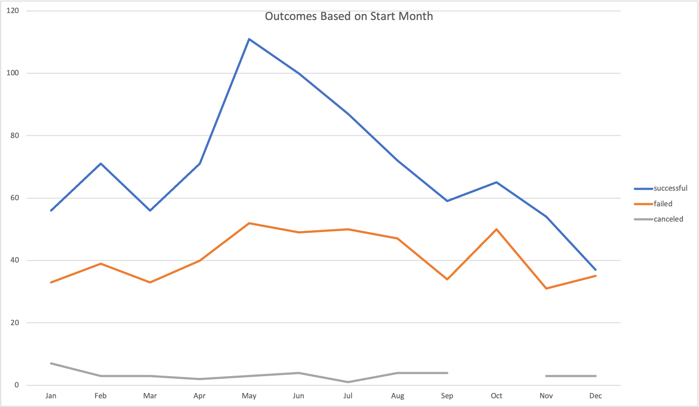

# An Analysis of Kickstarter Campaigns.

## Background

In this project, we will analyze the kickstarter campaign data. The objective is to determine:

* Which campaign categories and subcategories are more successful than others
* Discover any other attributes affect the campaign outcomes such as:
  * Geographic location
  * Campaign start month
  * Goal amount
* Analyze the data by calculating descriptive statistics and draw inferences.
* Visualize the data to discover trends.

## Approach to analyzing the kickstarter campaign data

The first analysis is to uncover the impact of a campaign's start month on its eventual outcome (successful or otherwise).

We make the following observations on this campaign data:

* A campaign is successful if the pledged amount is greater than or equal to the goal amount.
* Campaigns are run in many forms (such as theatre, music and television) and each form has further subcategories. Moreover, campaigns are run in many countries. All these factors could contribute to the eventual outcome of a campaign.
* Overall, there are a total of 4113 campaigns. Each campaign has the following important attributes which could potentially impact its outcome:
  * Location
  * Category
  * Subcategory
  * Goal amount
  * Launch date
* This is not a large data set to analyze. Excel is a perfect tool to run analyses. For this data set, not many potential difficulties were encountered.
* In general, the following difficulties could arise while analyzing data:
  * **Scale** - many data sets have billions of rows and thousands of columns. Not only it is hard to run quick analyses, it is not even clear which columns are useful.
  * **Lack of clean data**: Many a times, several data points are missing or invalid. Before running any analyses, a program must remove all rows consisting of invalid data points.
  * **Outliers**: If the data set has many outliers, data analysis inferences could be wrong. A program must remove all rows consisting of outliers.

## Analysis one - outcomes for Threatre by launch date

In this analysis exercise, we considered only the **Threatre** campaigns. We want to determine if the **Launch Date** of the Threatre campaigns influences their outcomes.

* First, we constructed a pivot table in which we counted all possible outcome values for every month. 
* Then, we plotted those outcome results for every month as a **line graph**. 

The summarized data from the pivot table is below.

| Month      | Successful Campaigns | Failed Campaigns | Canceled Campaigns | Total |
| ----------- | ----------- |---------|----------------|-------------|
| Jan | 56 | 33 | 7 | 96 |
| Feb | 71 | 39 | 3 | 113 |
| Mar | 56 | 33 | 3 | 92 |
| Apr | 71 | 40 | 2 | 113 |
| May | 111 | 52 | 3 | 166 |
| Jun | 100 | 49 | 4 | 153 |
| Jul | 87 | 50 | 1 | 138 |
| Aug | 72 | 47 | 4 | 123 |
| Sep | 59 | 34 | 4 | 97 |
| Oct | 65 | 50 | 0 | 115 |
| Nov | 54 | 31 | 3 | 88 |
| Dec | 37 | 35 | 3 | 75 |

The graph is shown below.

The following inferences can be drawn from the analysis:
* Threatre campaign outcomes are most successful in the months of May and June. For the month of May, 111 out of 166 campaigns succeeded and for the month of June, 100 out of 153 campaigns succeeded. For these two months, the probability of success is nearly **two thirds**.
* Conversely, Threatre campaigns were least successful in the month of December. Only 37 of 75 campaigns succeeded, making the success probability only about **half**.
* It can also be observed that the number of campaigns kicked off were the highest from May-July. However, the number of campaigns kicked off in the **off season months** also remains relatively high.
